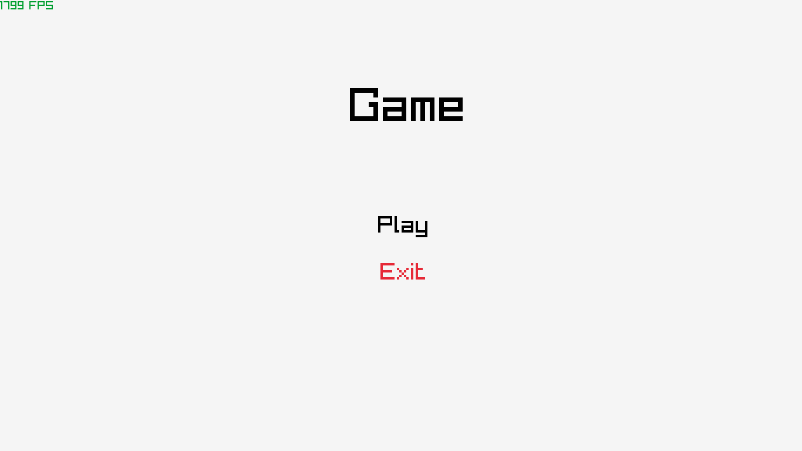

# Raylib Base Game

#### Base game structure with Raylib and C++.

Are implemented a game loop, a scenes handler, a base class for scenes, a
class to store scheduled events and two functions to create events:
`set_timeout` and `set_interval`.

    

